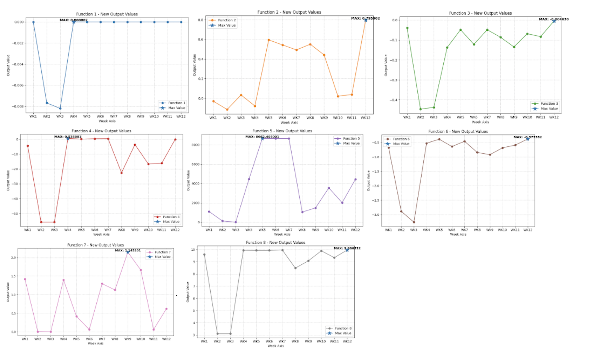

# Bayesian Optimization Strategies for Black-Box Functions

This project explores various Bayesian Optimization (BO) strategies to efficiently optimize several black-box functions. The goal is to find optimal input parameters that maximize the output of these functions, typically within a constrained search space. The notebook tracks weekly submissions, incorporating new evaluation results and adapting the BO approach over time.

## Setup and Environment

To run this notebook, the following steps are required:

1.  **Mount Google Drive**: The project relies on files stored in Google Drive. Ensure your Google Drive is mounted to `/content/drive/`.
    ```python
    from google.colab import drive
    drive.mount('/content/drive/')
    %cd /content/drive/My Drive/Colab Notebooks/
    ```
2.  **Install Dependencies**: The project utilizes `torch`, `botorch`, and `gpytorch` for Gaussian Process and Neural Network-based Bayesian Optimization, and `scikit-learn` for Logistic Regression.
    ```bash
    !pip install torch botorch gpytorch scikit-learn numpy matplotlib
    ```

## Incorporating Weekly Black-Box Evaluation Results

Each week, new input-output pairs are obtained from external black-box function evaluations. These results are stored in the `weekly_data_to_add` dictionary. This dictionary is crucial for updating the historical data for each function, ensuring that the Bayesian Optimization models learn from the most current and cumulative set of observations. The notebook includes logic to filter out invalid input values (e.g., those exceeding `0.999999`) before appending them to the dataset.

## Visualization of Current Week's New Output Data

To understand the impact of the latest black-box evaluations, the notebook generates visualizations for the newly added output data. Individual plots display the new outputs for each function, highlighting the maximum observed value. A combined, normalized plot is also provided, allowing for a comparative analysis of trends across different functions after min-max scaling their respective new outputs.

## Bayesian Optimization with Gaussian Process (GP) Surrogate

This section implements Bayesian Optimization using a Gaussian Process as the surrogate model. The core idea is to model the unknown black-box function probabilistically, which provides both a mean prediction and an uncertainty estimate for any input. This allows for intelligent exploration of the search space.

### Key Components:

*   **Data Aggregation**: Combines historical data with the latest weekly black-box results.
*   **Dynamic Dimensionality**: Automatically determines the input dimensionality and sets search bounds (0.0 to 0.999999).
*   **GP Model (`SingleTaskGP`)**: Fits a Gaussian Process model to the observed data, capturing the underlying function's behavior and uncertainty.
*   **Hyperparameter Optimization (`fit_gpytorch_mll`)**: Optimizes the GP's internal hyperparameters by maximizing the marginal log-likelihood.
*   **Adaptive Hyperparameter Heuristics**: Dynamically adjusts the `beta_value` for the UCB acquisition function. If observed outputs are consistently low or the data's standard deviation is small (suggesting convergence), `beta_value` is increased to encourage more exploration.
*   **Acquisition Function**: Uses either `LogExpectedImprovement` (EI) or `UpperConfidenceBound` (UCB) to guide the search for the next optimal input.
*   **Acquisition Function Optimization (`optimize_acqf`)**: Finds the input that maximizes the chosen acquisition function.
*   **Duplicate Handling**: Checks for and avoids suggesting input points that are too close to already evaluated ones. A small perturbation is applied as a fallback if a unique point cannot be found after multiple retries.

## Bayesian Optimization with Neural Network (NN) Surrogate

This approach utilizes a custom feed-forward Neural Network as the surrogate model for Bayesian Optimization, moving away from probabilistic models like GPs. The NN learns a direct mapping from input parameters to function outputs.

### Key Components:

*   **`NeuralNetworkSurrogate` Class**: Defines a simple multi-layer perceptron (MLP) with ReLU activations for two hidden layers and a single output neuron.
*   **`train_nn_surrogate` Function**: Handles the training of the NN using Adam optimizer and Mean Squared Error (MSE) loss for a specified number of epochs (100 in this implementation).
*   **Data Aggregation and Preparation**: Similar to the GP approach, historical and new data are combined and converted into PyTorch tensors.
*   **Acquisition Strategy**: Since standard NNs do not inherently provide uncertainty estimates, the acquisition strategy is different:
    1.  A set of `num_candidates` (e.g., 200) random input points are generated within the bounds.
    2.  The trained `NeuralNetworkSurrogate` predicts the output for each candidate.
    3.  The candidate with the highest predicted output is selected as the next suggested input.
*   **Duplicate Handling**: Similar to the GP method, this approach also incorporates checks for duplicate points and applies perturbations if a unique input cannot be found, ensuring diversity in the suggested evaluations.

## Bayesian Optimization with Logistic Regression (LR) Surrogate

This section introduces a unique Bayesian Optimization strategy that leverages Logistic Regression as the surrogate model. The core innovation here is the transformation of the continuous optimization problem into a binary classification task.


## Weekly Submissions History

The following is a chronological record of the Bayesian Optimization strategies employed and key observations from weekly evaluations:

*   **Week 1**: Initial exploration using random search with exploitation.
*   **Week 2-3**: Gaussian Process (GP) with `GPyOpt.methods.BayesianOptimization`. Noted issues with incorrect bounds leading to `1.000000` as a suggested input for some functions.
*   **Week 4-5**: Switched to Gpytorch BO, utilizing Beta 2.0 and Upper Confidence Bound (UCB) as the acquisition function.
*   **Week 6-7**: Continued with Gpytorch BO, but incorporated dynamic updates for hyperparameters like Beta and introduced the option for Expected Improvement (EI) alongside UCB.
*   **Week 8-9**: Explored Neural Networks as surrogate models, implemented with BoTorch.
*   **Week 10-11**: Adopted Logistic Regression as the surrogate model, treating the optimization as a binary classification problem.
*   **Week 12**: A hybrid approach was taken:
    *   **Functions 1-6**: PyTorch BO with Beta 2.0 and UCB, as this strategy had consistently yielded the highest performance.
    *   **Function 7**: Neural Networks with BoTorch.
    *   **Function 8**: Gpytorch BO with dynamically updated hyperparameters for Beta and UCB/EI.
*   **Week 13**: A hybrid approach was taken:
    *   **Functions 1-6**: PyTorch BO with Beta 2.0 and UCB, as this strategy had consistently yielded the highest performance.
    *   **Function 7**: Neural Networks with BoTorch.
    *   **Function 8**: Gpytorch BO with dynamically updated hyperparameters for Beta and UCB/EI.

### Sumbmission Progress:



### Key Components:

*   **Data Aggregation and Preparation**: As with other methods, historical and new data are combined. Inputs are used as features for the LR model.
*   **Output Binarization**: This is the crucial step. The continuous black-box function outputs (`Y_np`) are converted into binary labels (`y_binary`). A common heuristic is applied: outputs greater than the median of all observed outputs are labeled as `1` ('good' outcome), and others as `0` ('bad' outcome). This reframes the maximization problem into finding inputs likely to yield a 'good' classification.
*   **Logistic Regression Model (`sklearn.linear_model.LogisticRegression`)**: An LR model is trained on the historical inputs (`X_np`) and their binarized outputs (`y_binary`). `solver='liblinear'` and `C=0.1` are used for robust training with a small amount of regularization.
*   **Acquisition Strategy**: The goal is to maximize the probability of obtaining a 'good' outcome:
    1.  `num_candidates` random input points are generated within the search bounds.
    2.  The trained `LogisticRegression` model predicts the probability of each candidate belonging to class `1` (`lr_model.predict_proba`).
    3.  The candidate input with the highest predicted probability of being in class `1` is selected as the next suggested input.
*   **Duplicate Handling**: Similar mechanisms for checking and perturbing duplicate points are employed to ensure that diverse input suggestions are provided, even in cases where the acquisition function repeatedly points to already explored regions.

## Additioanl URLs
*   **Datasheet** : http://github.com/swarada/BBO-Capstone-Project/blob/main/documentation/Datasheet.md 
*   **Model Card** : https://github.com/swarada/BBO-Capstone-Project/blob/main/documentation/model-card.md 
